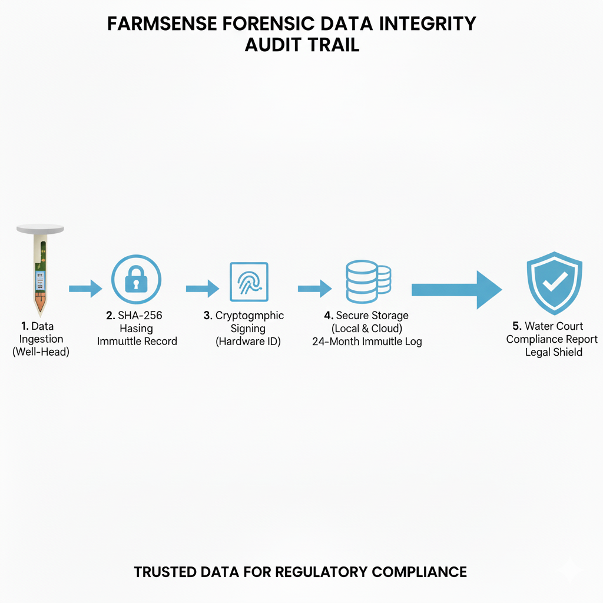

# FarmSense Leave Behind Packet

**For:** Colorado State University - San Luis Valley Research Center  
**Date:** February 2026  
**Subject:** Partnership Opportunity - Aquifer Recovery Pilot

* * *

## EXECUTIVE SUMMARY

FarmSense is deploying a **deterministic farming operating system** designed to eliminate irrigation guesswork through forensic-grade data integrity. We're requesting a Letter of Support for our CRD grant application to validate a 9-field pilot before the June 29 Water Court Trial.

**In exchange for your Letter of Support, CSU SLVRC receives:**

-   Open API access to 1-meter resolution soil moisture data
-   4 paid internships (2 Ag-Engineering + 2 Data Science)
-   Co-authorship on resulting peer-reviewed papers
-   Direct comparison to lysimeter measurements for validation

* * *

## VISUAL SNAPSHOT

### Deployment Phases
A log-scale view of how the pilot grows into the full 520,000-acre mandate.

### Concept Illustration
The Heavy Edge sensor mesh that anchors the Court-ready proof.

### Sensor Detail
A visualization of the Heavy Edge sensing tiers, focusing on the sensor-to-cloud journey.

* * *

## THE PROBLEM: WATER COURT REALITY

The Subdistrict 1 Water Plan mandates **15% pumping reduction across 520,000 acres**. Current solutions rely on:

-   Water balance estimates that cannot survive legal cross-examination
-   Monthly soil sampling that misses real-time variability
-   Satellite-only monitoring without ground truth validation

**Result:** Defensive "insurance pumping" that wastes water, energy, and money while failing to demonstrate compliance.

* * *

## THE SOLUTION: DETERMINISTIC FARMING OS

FarmSense replaces estimates with physical residuals using a "Heavy Edge" sensor network. Each Jetson Nano is paired with one gateway hub (LoRa + 5GHz mesh) to keep the field-level compute connected, so that per-field hardware budget includes both the Nano and its dedicated gateway.

### Architecture

- Tier 1: Physical Sensors (Ground Truth)
  - Horizontal blankets: 18" sensors at 12"/18" depths
  - Master vertical nails: 42" (5-depth) or 60" (7-depth)
- Tier 2: Dynamic Soil Mapping
  - Recursive Bayesian filter learns soil texture from moisture movement
- Tier 3: Satellite Multi-Spectral
  - Sentinel-1/2 for NDVI, NDWI, and SAR radar

### Pilot Specifications

| Component | Value |
| --- | --- |
| **Fields** | 9 (hub-and-spoke topology) |
| **Acreage** | ~1,170 acres |
| **Sensors** | ~108 total |
|   
 | \- ~99 horizontal blankets (18", 2-depth) |
|   
 | \- 9 master vertical nails (42" OR 60") |
| **Measurement points** | ~270 |
| **Primary compute** | 1× NVIDIA Jetson Nano |
| **Backup** | Hosted cloud + cold spare on-site |
| **Gateway hubs** | Each Jetson Nano pairs with its own gateway hub (LoRa + 5GHz mesh), adding to per-field hardware costs |
| **Update interval** | 15 minutes |
| **Spatial resolution** | 1-meter virtual grid |

* * *

## FORENSIC-GRADE DATA INTEGRITY

Designed specifically to survive **Water Court cross-examination**:

| Feature | Implementation |
| --- | --- |
| **Hashing** | SHA-256 at well-head |
| **Signing** | Cryptographic keys in hardware module |
| **Audit trail** | Immutable, timestamped logs |
| **Storage** | 24 months local + hosted cloud backup |
| **Compliance** | Automated State Engineer reports |

* * *

## THE JUNE 29 TRIAL

**Critical Timeline:**

-   February 14: CSU Letter of Support needed
-   February 28: Grant award notification
-   April 15 - May 15: Field installation
-   June 1: Full operations begin
-   **June 29: Water Court Trial**

**The pilot must demonstrate:**

1.  Physical ground truth from sensor residuals
2.  Automated compliance reporting without manual manipulation
3.  Immutable audit trails with cryptographic verification
4.  Third-party validation from CSU SLVRC

* * *

## PARTNERSHIP BENEFITS

### What CSU SLVRC Receives

| Benefit | Detail |
| --- | --- |
| **Data access** | Open API to 1m-resolution soil moisture |
| **Internships** | 2 Ag-Eng + 2 Data Science (paid) |
| **Co-authorship** | Credit on peer-reviewed papers |
| **Verification** | Direct comparison to lysimeter measurements |
| **Research access** | Real-time validation infrastructure |

### CSU's Commitment

| Requirement | Timeline |
| --- | --- |
| **Letter of Support** | February 14, 2026 |
| **Co-location** | Sensor placement near lysimeters |
| **Validation** | Comparative analysis methodology |

* * *

## SCALING TO REGIONAL MANDATE

### Phase 2 (Fall 2026)

-   100 fields (~13,000 acres)
-   ~12 Jetson Nanos, distributed architecture
-   Validated cost model for full deployment

### Full Mandate (2027+)

-   520,000 acres across ~4,000 fields
-   ~48,000 sensors, ~110,000 measurement points
-   ~445 Jetson Nanos, 30-50 gateway hubs
-   **Economic impact: $25M-$50M annually**

* * *

## COMPETITIVE DIFFERENTIATION

| Feature | FarmSense | Traditional Solutions |
| --- | --- | --- |
| **Physical residuals** | 2-depth + 5/7-depth sensors | Satellite-only estimates |
| **Update frequency** | 15 minutes | Weekly or monthly |
| **Spatial resolution** | 1-meter grid | 30-meter satellite pixels |
| **Processing** | Heavy Edge (on-field) | Cloud-dependent |
| **Compliance** | Automated forensic reports | Manual compilation |
| **Failover** | Triple redundancy | Single point of failure |

* * *

## CONTACT INFORMATION

**Lead Architect:** Jeremy Beebe  
**Organization:** Bxthre3 Inc.  
**Email:** [getfarmsense@gmail.com](mailto:getfarmsense@gmail.com)  
**Phone:** 7198508651

* * *

## DEVELOPMENT SCHEDULE

-   **February 2026:** Finalize pilot design and documentation
-   **March 2026:** Secure CRD grant and CSU Letter of Support
-   **April 2026:** Field installation and initial calibration
-   **May 2026:** Full operations and data collection
-   **June 2026:** Water Court Trial preparation and validation

* * *

## APPENDIX: TECHNICAL DEEP DIVE

### The Bayesian Engine

FarmSense OS runs a **Recursive Bayesian Filter** on the Edge GPU:

1.  **Predict:** Generate moisture state from soil map and ET data
2.  **Observe:** Ingest latest sensor residuals and satellite clips
3.  **Update:** Adjust local soil coefficients if error exceeds threshold

### Regression Kriging

-   **GPU acceleration:** CuPy for matrix operations
-   **Trend variable:** Satellite data defines spatial shape
-   **Hard constraints:** Physical sensor residuals anchor values
-   **Output:** 1-meter virtual grid in <5 seconds

### Sensor Specifications

**Horizontal Blanket Sensors:**

-   Length: 18"
-   Depths: 12" and 18"
-   Coverage: 1 per 10-14 acres
-   Lifespan: 20+ years
-   Material: 3/16" stainless steel

**Master Vertical Nails:**

-   **Medium (42"):** 5 depths (18", 24", 30", 36", 42") for potatoes/barley
-   **Large (60"):** 7 depths (18", 24", 30", 36", 42", 52", 60") for alfalfa
-   Lifespan: 20+ years
-   Material: 3/16" stainless steel

* * *

**Document Version:** 3.9 (Canonical)  
**Date:** February 2026