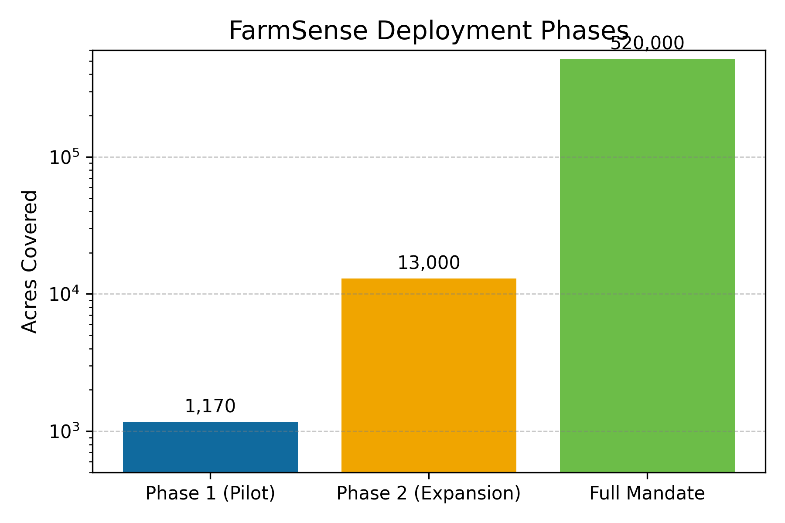
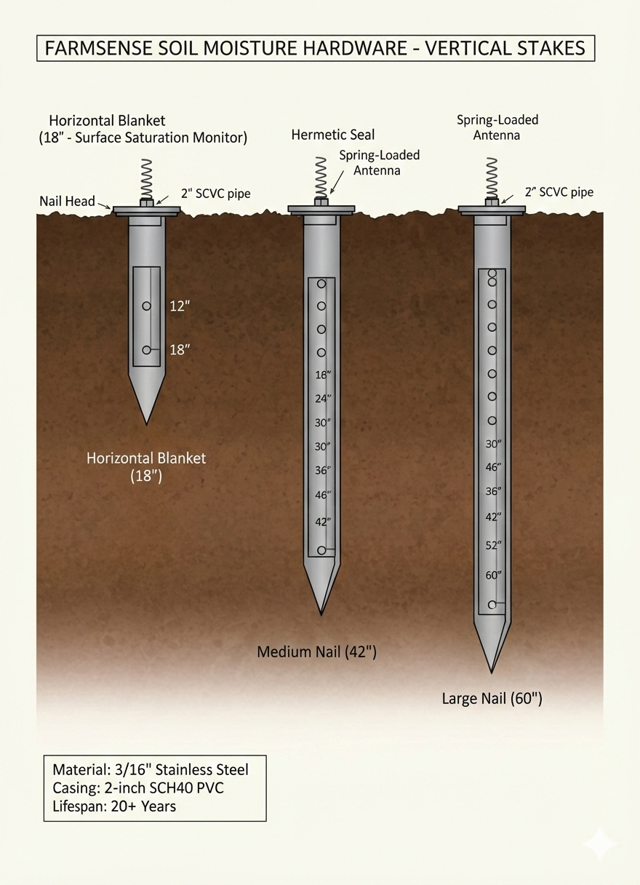

# FarmSense CSU Meeting Packet - Team Briefing

**Date:** February 2026  
**Meeting:** CSU San Luis Valley Research Center Partnership  
**Purpose:** Brief team members/stakeholders on CSU meeting and outcomes

* * *

## EXECUTIVE SUMMARY

FarmSense met with CSU SLVRC to secure a Letter of Support for our CRD grant application. This partnership is critical for validating our 9-field pilot before the June 29 Water Court Trial. In exchange for CSU's validation, we provide open API access to 1-meter soil data, 4 paid internships, and co-authorship on peer-reviewed papers.

* * *

## MEETING OBJECTIVES

### Primary Goal

Secure Letter of Support from CSU SLVRC by February 14, 2026

### Secondary Goals

Establish CSU as third-party validation partner
Clarify mutual benefits and expectations
Confirm co-location for lysimeter comparison
Setup data access and research collaboration framework

* * *

## VISUAL SUMMARY

### Strategic Timeline

This image illustrates the key phases of our deployment strategy, from initial planning to full-scale implementation. The timeline is crucial for understanding our progress and ensuring we meet critical milestones, such as the June 29 Water Court Trial.

### Observation Concept

This image represents the Heavy Edge architecture, which combines physical sensors with dynamic soil mapping and satellite data to provide a comprehensive, forensic-grade view of soil moisture. The concept is central to our approach and will be validated through the CSU partnership.

* * *

## PILOT OVERVIEW

### What We're Deploying

**FarmSense Deterministic Farming OS** - A "Heavy Edge" sensor network that provides forensic-grade irrigation auditing capable of surviving Water Court cross-examination.

### Architecture

- Tier 1: Physical Sensors (Ground Truth)
  - Horizontal blankets: 18" at 12"/18" depths
  - Master vertical nails: 42" (5-depth) or 60" (7-depth)
- Tier 2: Dynamic Soil Mapping
  - Recursive Bayesian filter learns soil texture
- Tier 3: Satellite Multi-Spectral
  - Sentinel-1/2 for NDVI, NDWI, and SAR radar

Every Jetson Nano is matched with a dedicated gateway hub (LoRa + 5GHz mesh), so the per-field hardware budget covers both pieces of hardware.

### Pilot Specifications

| Component | Value |
| --- | --- |
| **Fields** | 9 (hub-and-spoke topology) |
| **Acreage** | ~1,170 acres |
| **Sensors** | ~108 total |
|   
 | \- ~99 horizontal blankets (18", 2-depth) |
|   
 | \- 9 master vertical nails (42" OR 60") |
| **Measurement points** | ~270 |
| **Primary compute** | 1× NVIDIA Jetson Nano |
| **Backup** | Hosted cloud + cold spare on-site |
| **Gateway hubs** | Each Jetson Nano pairs with its own gateway hub (LoRa + 5GHz mesh), which increases the per-field hardware cost |
| **Update interval** | 15 minutes |
| **Spatial resolution** | 1-meter virtual grid |

* * *

## THE CSU PARTNERSHIP

### What We Need from CSU

| Requirement | Timeline | Status |
| --- | --- | --- |
| **Letter of Support** | February 14, 2026 | Pending |
| **Co-location approval** | April 2026 | Pending |
| **Research collaboration** | Ongoing | Discussed |

### What CSU Receives

| Benefit | Detail | Value to CSU |
| --- | --- | --- |
| **Data access** | Open API to 1m-resolution soil moisture | Research infrastructure |
| **Internships** | 2 Ag-Eng + 2 Data Science (paid) | Student development |
| **Co-authorship** | Credit on peer-reviewed papers | Academic recognition |
| **Verification** | Direct comparison to lysimeter measurements | Methodology validation |

* * *

## THE JUNE 29 TRIAL

### Why This Date Matters

The June 29, 2026 Water Court Trial is **IMMUTABLE** - it cannot be moved or postponed. This trial will determine whether FarmSense's forensic-grade data can survive legal cross-examination regarding aquifer depletion in Subdistrict 1.

### What We Must Prove

| Requirement | Our Solution |
| --- | --- |
| **Physical ground truth** | Sensor residuals with SHA-256 hashing |
| **Automated compliance** | No manual data manipulation |
| **Immutable audit trail** | Cryptographic signing at well-head |
| **Third-party validation** | CSU SLVRC partnership |

### Timeline to Trial

| Date | Milestone | Status |
| --- | --- | --- |
| February 14 | CSU Letter of Support due | Pending this meeting |
| February 28 | Grant award notification | Awaiting award |
| April 15 - May 15 | Field installation (9 fields) | Planned |
| June 1 | Full operations begin | Planned |
| **June 29** | **Water Court Trial** | Critical deadline |

* * *

## SCALING STRATEGY

### Phase 1: Pilot (Spring 2026) Current Focus

-   9 fields, ~1,170 acres
-   Validate forensic integrity
-   Demonstrate automated compliance
-   Secure Water Court acceptance

### Phase 2: Expansion (Fall 2026)

-   100 fields (~13,000 acres)
-   ~12 Jetson Nanos
-   Distributed architecture
-   Validated cost model

### Phase 3: Full Mandate (2027+)

-   520,000 acres (~4,000 fields)
-   ~48,000 sensors
-   ~110,000 measurement points
-   ~445 Jetson Nanos
-   **Economic impact: $25M-$50M annually**

* * *

## COMPETITIVE ADVANTAGE

| Feature | FarmSense | Traditional Solutions |
| --- | --- | --- |
| **Physical residuals** | 2-depth + 5/7-depth sensors | Satellite-only estimates |
| **Update frequency** | 15 minutes | Weekly or monthly |
| **Spatial resolution** | 1-meter grid | 30-meter satellite pixels |
| **Processing** | Heavy Edge (on-field) | Cloud-dependent |
| **Compliance** | Automated forensic reports | Manual compilation |
| **Failover** | Triple redundancy | Single point of failure |
| **Court admissible** | Yes, forensic-grade | No, estimates only |

* * *

## BUDGET OVERVIEW

### Grant Application (CRD)

-   **Requested:** $149,500
-   **Total project value:** $1,000,000
-   **Leveraged funding:** $850,500

### Budget Allocation

| Category | Amount | Purpose |
| --- | --- | --- |
| Sensor fabrication | $60,000 | ~108 sensors |
| Compute hardware | $15,000 | Jetson Nano, gateways, cold spare |
| Installation & labor | $30,000 | Field deployment, calibration |
| Data infrastructure | $20,000 | Hosted cloud, API development |
| Project management | $15,000 | Coordination, compliance reporting |
| Contingency | $9,500 | 10% buffer |

* * *

## KEY TEAM CONTACTS

### FarmSense Team

-   **Lead Architect:** Jeremy Beebe
-   **Email:** [getfarmsense@gmail.com](mailto:getfarmsense@gmail.com)
-   **Phone:** 7198508651
-   **Role:** Technical lead, CSU relationship management

### CSU SLVRC Contacts

-   **\[Name\]:** \[Title\]
-   **Email:** \[Their email\]
-   **Role:** \[Their role\]

* * *

## MEETING OUTCOMES

### Confirmed

-   CSU understands project scope and timeline
-   Partnership benefits are mutually beneficial
-   Letter of Support template will be provided
-   Co-location with lysimeters approved in principle

### Pending

-   Letter of Support signature (due February 14)
-   Formal MOU for data access and co-location
-   Kickoff call scheduling (target: March 1)
-   Internship candidate identification

### Action Items

| Task | Owner | Due Date |
| --- | --- | --- |
| Email LOS template | Jeremy | Today (after meeting) |
| Follow-up summary email | Jeremy | Within 24 hours |
| Schedule kickoff call | CSU | By February 20 |
| Identify internship candidates | CSU | By March 1 |
| Formalize data access MOU | Both | By March 15 |

* * *

## FREQUENTLY ASKED QUESTIONS

### Q: Why is CSU's Letter of Support so important?

**A:** Third-party validation from a respected research institution provides credibility for the grant application and demonstrates that FarmSense has been reviewed and endorsed by water research experts.

### Q: What happens if CSU doesn't provide the Letter of Support?

**A:** We have alternative validators identified (local ag consultants, pivot manufacturers), but CSU is our preferred partner due to their research credibility and lysimeter infrastructure.

### Q: Why the rush for February 14?

**A:** This is the CRD grant deadline. Missing this date means we lose the $149,500 funding and cannot proceed with the pilot before the June 29 trial.

### Q: What if the trial is delayed?

**A:** The trial date is set by the Water Court and is immovable. We must be ready with validated forensic data by June 29.

### Q: How does the CSU partnership help long-term?

**A:** Beyond immediate grant support, CSU collaboration provides:

-   Ongoing research credibility
-   Peer-reviewed publications
-   Access to student talent pipeline
-   Validation infrastructure for future deployments

* * *

## NEXT STEPS FOR TEAM

### Immediate (This Week)

-   Review meeting outcomes
-   Confirm understanding of partnership terms
-   Prepare for grant award notification (February 28)

### Short-term (February - March)

-   Finalize MOU with CSU
-   Begin sensor fabrication
-   Identify and contact 9 field locations
-   Prepare installation documentation

### Medium-term (April - June)

-   Execute field installation (April 15 - May 15)
-   System calibration and testing (May 15 - June 1)
-   Collect 4 weeks of operational data (June 1 - June 29)
-   Prepare Water Court testimony materials

* * *

## RESOURCES

### Documentation

-   Project FarmSense: Master Documentation (v3.9)
-   Software Technical Specification (v3.9)
-   Internal System Specifications (v3.9)
-   CSU Meeting Brief: Executive Summary (v3.9)
-   Grant Application: CRD Community Funding Partnership (v3.9)

### Technical References

-   Deterministic Farming OS Metrics Framework (v3.9)
-   Strategic Analysis: Gap & Risk Assessment (v3.9)
-   FarmSense Meeting Guide: Track & Talking Points (v3.9)

* * *

## SUCCESS METRICS

### Pilot Phase Success Criteria

-   15-20% pumping reduction vs. baseline
-   Zero deep percolation events at 42"/60" horizons
-   100% Water Court data admissibility
-   Forensic data integrity verified
-   CSU Letter of Support secured

### Long-term Success Criteria

-   520,000 acres under deterministic management
-   15% district-wide pumping reduction
-   $25M-$50M annual economic impact
-   48,000+ sensors deployed
-   445+ Jetson Nanos operational

* * *

**Document Version:** 3.9 (Canonical)  
**Date:** February 2026  
**Prepared by:** FarmSense Team