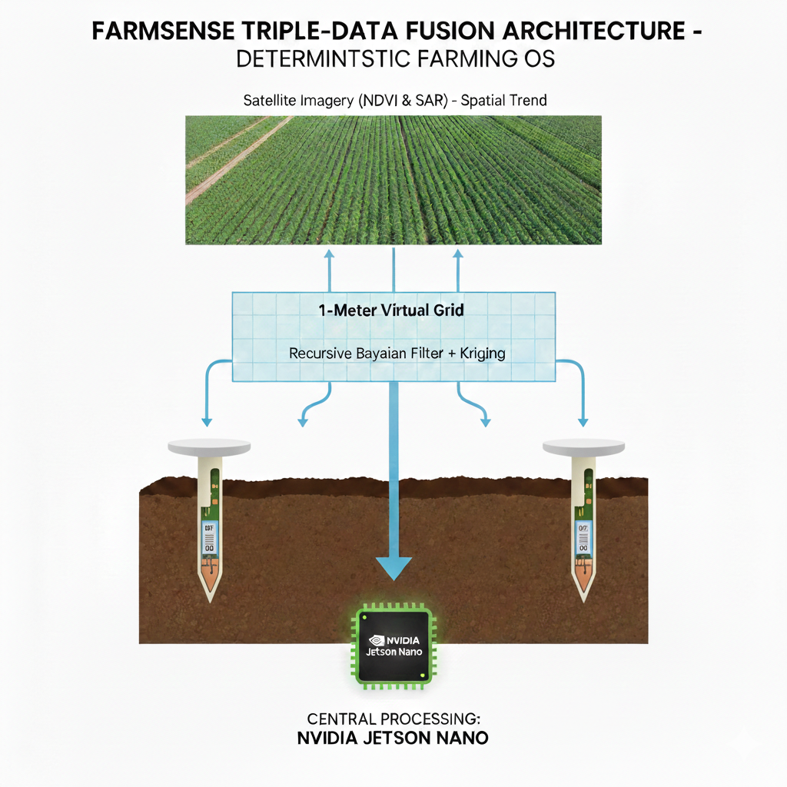

# FarmSense User Meeting Packet

**For:** CSU SLVRC Partnership Meeting  
**Date:** February 2026  
**Goal:** Secure Letter of Support by February 14, 2026

* * *

## MEETING OVERVIEW

**Primary Objective:** Obtain Letter of Support for CRD Grant Application  
**Secondary Objectives:** Establish CSU as validation partner, clarify partnership benefits

**Key Decision Maker:** CSU SLVRC Leadership  
**Meeting Duration:** 60 minutes

* * *

## VISUAL HIGHLIGHTS

### Deployment Snapshot

A concise visual of how the pilot scales into the full mandate.
Each Jetson Nano requires its own gateway hub, which increases the per-field cost burden.

### Sensor Ecosystem Concept

An illustration of the Heavy Edge sensor network and its multi-tier data fusion.

* * *

## OPENING STATEMENT (60 seconds)

"We're deploying a deterministic farming operating system for the San Luis Valley—a Heavy Edge sensor network that replaces irrigation guesswork with physical ground truth. We're requesting a Letter of Support from CSU SLVRC to validate the pilot before our June 29 Water Court Trial. In exchange, you get open API access to 1-meter soil data, paid internships, and co-authorship on resulting papers."

* * *

## TALKING TRACKS

### Track 1: The Problem (Water Court Reality)

**Script:** "The Subdistrict 1 Water Plan mandates 15% pumping reduction across 520,000 acres. Current solutions rely on satellite estimates that can't survive cross-examination. FarmSense provides forensic-grade data integrity—SHA-256 hashing, cryptographic signing, and physical sensor residuals that prove exactly where every gallon went."

**Key Numbers:**

-   15% mandated reduction
-   520,000 acres (full mandate)
-   June 29 trial date

**Talking Points:**

-   Emphasize the IMMUTABLE trial deadline - cannot move
-   Current solutions fail under legal scrutiny
-   Defensive "insurance pumping" wastes money and water
-   Need physical evidence, not estimates

* * *

### Track 2: The Solution (Triple-Data Architecture)

**Script:** "We deploy three sensor types: 18" horizontal blankets at 12"/18" depths for horizontal truth, and master vertical nails at 42" or 60" depending on crop for vertical verification. One Jetson Nano processes all 9 fields in 15-minute intervals using Bayesian inference. Backup is off-site hosted cloud plus cold spare hardware on-site. Each Jetson Nano pairs with its own gateway hub (LoRa + 5GHz mesh), so the per-field hardware budget accounts for both units."

**Key Numbers:**

-   9 fields, ~1,170 acres
-   ~99 horizontal blankets + 9 master nails = ~108 sensors
-   ~270 measurement points
-   1 Jetson Nano (primary) + hosted cloud backup + cold spare
-   15-minute update intervals

**Talking Points:**

-   Heavy Edge processing - no cloud dependency for decisions
-   Triple redundancy ensures reliability
-   Sub-second interpolation to 1-meter grid
-   Forensic-grade data integrity built in

* * *

### Track 3: The Pilot Scope

**Script:** "The pilot is 9 fields in hub-and-spoke topology. Each field gets about 11 horizontal blankets and 1 master nail. The central Jetson handles all 9 fields, with automatic failover to hosted cloud if primary fails. We're validating forensic data integrity before scaling to the full 520,000-acre mandate."

**Component Breakdown:**

| Component | Count | Purpose |
| --- | --- | --- |
| Fields | 9 | Hub-and-spoke topology |
| Total acreage | ~1,170 | Average 130 acres/field |
| Horizontal blankets | ~99 | Horizontal moisture distribution |
| Master vertical nails | 9 | Vertical ground truth calibration |
| Jetson Nano (primary) | 1 | Processes all 9 fields |
| Jetson Nano (cold spare) | 1 | Emergency backup on-site |
| Gateway hubs | 1-2 | LoRa + 5GHz mesh connectivity |

**Talking Points:**

-   Cost-efficient design: 1 Jetson serves 9 fields
-   Validates architecture before $25M+ regional deployment
-   4 weeks of operational data before trial (June 1 - June 29)
-   Real-world validation, not theoretical modeling

* * *

### Track 4: The CSU Partnership

**Script:** "We need a Letter of Support by February 14 for the CRD grant. CSU provides third-party credibility by co-locating with your lysimeters. You get open API access to 1-meter grid data for research and publication, plus paid internships for Ag-Engineering and Data Science students."

**What CSU Receives:**

| Benefit | Detail |
| --- | --- |
| Data access | Open API to 1m-resolution soil moisture |
| Internships | 2 Ag-Eng + 2 Data Science (paid) |
| Co-authorship | Credit on resulting peer-reviewed papers |
| Verification | Direct comparison to lysimeter measurements |

**Talking Points:**

-   CSU credibility is critical for grant approval
-   Open API provides research infrastructure
-   Internships support student development
-   Co-authorship builds academic reputation
-   Lysimeter comparison validates methodology

* * *

## OBJECTION HANDLING

### Objection 1: "Why not just use satellite?"

**Response:** "Satellite is our trend variable, but it can't survive Water Court. We need physical 'Nails'—ground-truth residuals that prove moisture distribution. Satellite alone gives estimates; sensors give evidence."

**Key Points:**

-   Satellite CAN'T be cross-examined in court
-   Physical sensors = forensic evidence
-   Satellite IS used (as Tier 3), but not alone
-   30-meter pixels vs 1-meter resolution

* * *

### Objection 2: "Is 9 fields enough to validate?"

**Response:** "For the trial, we need to prove forensic integrity and automated compliance reporting. The 9-field pilot generates ~270 measurement points with full audit trails. Phase 2 scales to 520,000 acres using the same proven architecture—~48,000 sensors across 4,000 fields."

**Key Points:**

-   Purpose: validate FORENSIC INTEGRITY, not regional coverage
-   270 measurement points = robust statistical sample
-   Same architecture scales to 48,000 sensors
-   Cost validation is critical for regional rollout
-   9 fields = ~1,170 acres (not trivial)

* * *

### Objection 3: "What if the Jetson fails?"

**Response:** "We have triple redundancy: primary Jetson processing all 9 fields, off-site hosted cloud backup, and a cold spare Jetson stored on-site. Failover time is under 30 minutes—well within our 15-minute update interval tolerance."

**Key Points:**

-   30-minute downtime acceptable for 15-minute intervals
-   Automatic failover to hosted cloud
-   Cold spare on-site for extended outages
-   Data never lost: 24 months local storage
-   Trial uses AUDIT TRAIL, not real-time data

* * *

### Objection 4: "How does this compare to lysimeters?"

**Response:** "Lysimeters provide point measurements at specific depths. FarmSense provides continuous 1-meter grid coverage across 1,170 acres with the same forensic rigor. We want to co-locate to validate our virtual grid against your physical measurements."

**Key Points:**

-   Lysimeters = point measurements (gold standard)
-   FarmSense = continuous 1-meter grid
-   Complementary, not competitive
-   Co-location validates methodology
-   FarmSense scales beyond lysimeter practicality

* * *

## CLOSING ASK

**Script:** "Can we count on CSU SLVRC for a Letter of Support by February 14? I'll send the template today—all it needs is a signature. The pilot installs April-May, with full operations by June 1, giving us four weeks of data before the trial."

**Specific Request:**

1.  Letter of Support by February 14, 2026
2.  I'll email template immediately after meeting
3.  Simple signature required
4.  Confirm contact for data access setup
5.  Schedule kickoff call for March 1

* * *

## IMMEDIATE NEXT STEPS

### If they say YES:

1.  Email LOS template before leaving the building
2.  Confirm contact for data access setup
3.  Schedule kickoff call for March 1
4.  Exchange contact information
5.  Send follow-up summary email within 24 hours

### If they say MAYBE:

1.  Offer site visit to see sensor hardware
2.  Provide references from other research partners
3.  Follow up within 48 hours
4.  Address any remaining concerns
5.  Provide additional technical documentation if needed

### If they say NO:

1.  Ask what would change their position
2.  Offer reduced scope (data access only, no internships)
3.  Leave contact info for future consideration
4.  Request feedback for improvement
5.  Maintain relationship for future opportunities

* * *

## QUICK REFERENCE: KEY NUMBERS

| Metric | Value |
| --- | --- |
| Pilot fields | 9 |
| Pilot acreage | ~1,170 |
| Total sensors | ~108 |
| Measurement points | ~270 |
| Update interval | 15 minutes |
| Spatial resolution | 1 meter |
| Primary compute | 1 Jetson Nano |
| Backup | Hosted cloud + cold spare |
| Grant deadline | February 14 |
| Trial date | June 29 |
| Regional mandate | 520,000 acres |

* * *

## CRITICAL DATES

| Date | Milestone |
| --- | --- |
| Today | CSU Meeting |
| February 14 | CSU Letter of Support due |
| February 28 | Grant award notification |
| March 1 | Kickoff call with CSU |
| April 15 - May 15 | Field installation |
| June 1 | Full operations begin |
| **June 29** | **Water Court Trial** |

* * *

## PARTNERSHIP BENEFITS SUMMARY

### For CSU:

Open API to 1-meter resolution data
4 paid internships ($X total value)
Co-authorship on peer-reviewed papers
Validation infrastructure for future research
Competitive advantage in water research

### For FarmSense:

Third-party validation credibility
Letter of Support for grant application
Lysimeter comparison data
Academic partnership reputation
Access to CSU research expertise

* * *

## CONTACT INFORMATION

**Your Info:**

-   Name: Jeremy Beebe
-   Organization: Bxthre3 Inc.
-   Email: [getfarmsense@gmail.com](mailto:getfarmsense@gmail.com)
-   Phone: 7198508651

**CSU SLVRC Contact:**

-   Name: \[Their Name\]
-   Title: \[Their Title\]
-   Email: \[Their Email\]
-   Phone: \[Their Phone\]

* * *

## MEETING NOTES

\[Space for notes during meeting\]

* * *

**Document Version:** 3.9 (Canonical)  
**Date:** February 2026